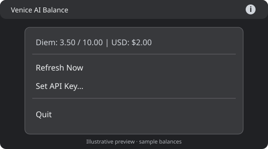

# Venice Status Bar

A small Linux status bar indicator for your Venice AI balance. Click the icon to see your remaining Diem, daily Diem allocation, and prepaid USD balance.

Built with Python, GTK 3, and AppIndicator. Originally used on Ubuntu; the current version has been deployed on Fedora 44 Workstation with GNOME. This is an unofficial project, unaffiliated with Venice AI.



*Illustrative preview; desktop appearance varies by theme and extension.*

## Features

- Refreshes at startup and every 30 minutes.
- Provides **Refresh Now**, **Set API Key…**, and **Quit** menu actions.
- Fetches balances in a background thread so the menu stays responsive.
- Handles unavailable balances, authentication failures, rate limits, and connection errors.
- Supports Ayatana AppIndicator, with a fallback to AppIndicator3.

Example menu balance:

```text
Diem: 3.50 / 10.00  |  USD: $2.00
```

Opening the menu shows the most recently fetched balance. Use **Refresh Now** to update it immediately.

## Requirements

- Python 3, Requests, and PyGObject.
- GTK 3 and an AppIndicator introspection library.
- A desktop session that displays AppIndicator icons.
- A Venice **admin API key** for the billing endpoint. See the [Venice billing reference](https://github.com/veniceai/skills/blob/main/skills/venice-billing/SKILL.md).

### Fedora Workstation

Install the dependencies:

```bash
sudo dnf install python3-gobject python3-requests gtk3 libappindicator-gtk3 gnome-shell-extension-appindicator
```

Enable [AppIndicator and KStatusNotifierItem Support](https://extensions.gnome.org/extension/615/appindicator-support/) in GNOME's Extensions application. If you just installed the extension, log out and back in first.

```bash
gnome-extensions enable appindicatorsupport@rgcjonas.gmail.com
```

Fedora publishes the [AppIndicator extension package](https://packages.fedoraproject.org/pkgs/gnome-shell-extension-appindicator/gnome-shell-extension-appindicator/).

### Ubuntu

The original script ran on Ubuntu. These are the expected dependencies for the updated version; its Ubuntu setup has not been retested:

```bash
sudo apt install python3-gi python3-requests gir1.2-gtk-3.0 gir1.2-ayatanaappindicator3-0.1
```

Ubuntu GNOME also needs AppIndicator support enabled. The [Ayatana introspection package](https://packages.ubuntu.com/search?keywords=gir1.2-ayatanaappindicator3-0.1&searchon=names) supplies the preferred indicator library.

## Run

From the project directory:

```bash
/usr/bin/python3 venice_indicator.py
```

Click the status bar icon, choose **Set API Key…**, paste your Venice admin API key, and select **Save**. The balance refreshes automatically.

## API key storage

The menu saves your key in:

```text
~/.config/venice-indicator/config.json
```

If `XDG_CONFIG_HOME` is set, the file instead lives at `$XDG_CONFIG_HOME/venice-indicator/config.json`.

The key is stored as **plain text**, not encrypted or in a keyring. The application creates the configuration directory with mode `700` and writes the file with mode `600` (only your account can read or write it). An existing directory's permissions are not changed. Keep the file out of source control, shared backups, and screenshots.

Alternatively, provide `VENICE_API_KEY` in the process environment. A nonempty environment value takes precedence over the saved file at startup. The menu can change the key for the running process and save it, but on the next launch an existing environment value takes precedence again. Environment-only usage does not create a configuration file.

The application sends the key as a Bearer token over HTTPS to:

```text
https://api.venice.ai/api/v1/billing/balance
```

To remove a saved key, quit the application and delete the configuration file. Revoke the key in Venice if you want to invalidate it.

## Install and start at login

Run the installer from the project directory, without `sudo`:

```bash
/usr/bin/python3 install.py
```

It installs a copy of the script under `~/.local/share/venice-indicator` and creates `~/.config/autostart/venice-indicator.desktop`. It respects `XDG_DATA_HOME` and `XDG_CONFIG_HOME` if set to absolute paths. The desktop entry is generated from `deployment/venice-indicator.desktop` with your installation path. It does not install dependencies or launch the application.

Launch the installed copy now, or log out and back in:

```bash
/usr/bin/python3 "${XDG_DATA_HOME:-$HOME/.local/share}/venice-indicator/venice_indicator.py"
```

Quit any running instance first to avoid duplicate icons. After updating the source, rerun the installer and restart the application. Installing again preserves your saved API key.

To disable autostart, remove `~/.config/autostart/venice-indicator.desktop`. To uninstall, also remove `~/.local/share/venice-indicator` after quitting. Your saved API key remains in the separate configuration directory unless you remove it. If you use custom XDG directories, use those paths instead of the defaults above.

## Troubleshooting

| Symptom | What to check |
| --- | --- |
| No status icon | Enable GNOME AppIndicator support; confirm the process is running in your desktop session. |
| `Namespace … not available` | Install GTK/AppIndicator dependencies and use the system Python. |
| Authentication failed | Check that the key is valid and has admin access. |
| Diem unavailable | The account may not have a Diem allocation; check the USD balance separately. |
| Connection failed or timeout | Check your network and use **Refresh Now**. |
| Rate limited | Wait before refreshing again. |
| Unexpected response | Venice returned data the application could not interpret. |

On an error, the menu replaces the previous balance with an error message. The next scheduled refresh still runs.

## Development and tests

Install the runtime dependencies above and `desktop-file-validate` (Fedora: `desktop-file-utils`; Ubuntu: `desktop-file-utils`), then run:

```bash
/usr/bin/python3 -m unittest discover -s tests -v
```

The tests use dummy credentials and mocked HTTP requests; no account or network access is needed. They cover balance formatting, null and invalid values, HTTP errors, malformed JSON, timeouts, connection failures, and installation to paths containing spaces and special characters. The installer test checks the generated desktop entry and preservation of an existing key file. No display session is needed to run these tests.

## Validation and limitations

The application starts successfully on Fedora 44. Live balance retrieval requires your own key. The updated version has not been retested on Ubuntu.

The application currently has no single-instance protection or keyring integration. The menu preview above is an illustration, not a desktop screenshot.

## License

[MIT](LICENSE).
